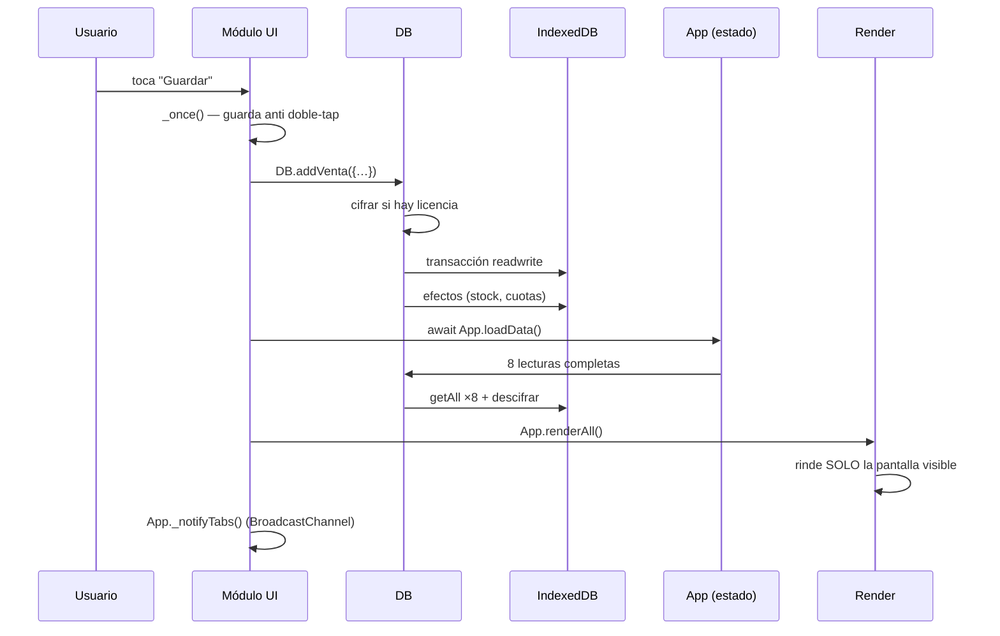
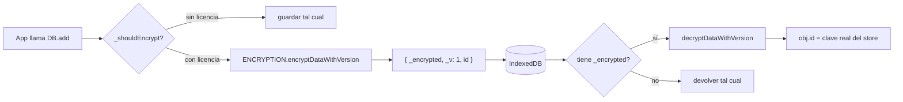
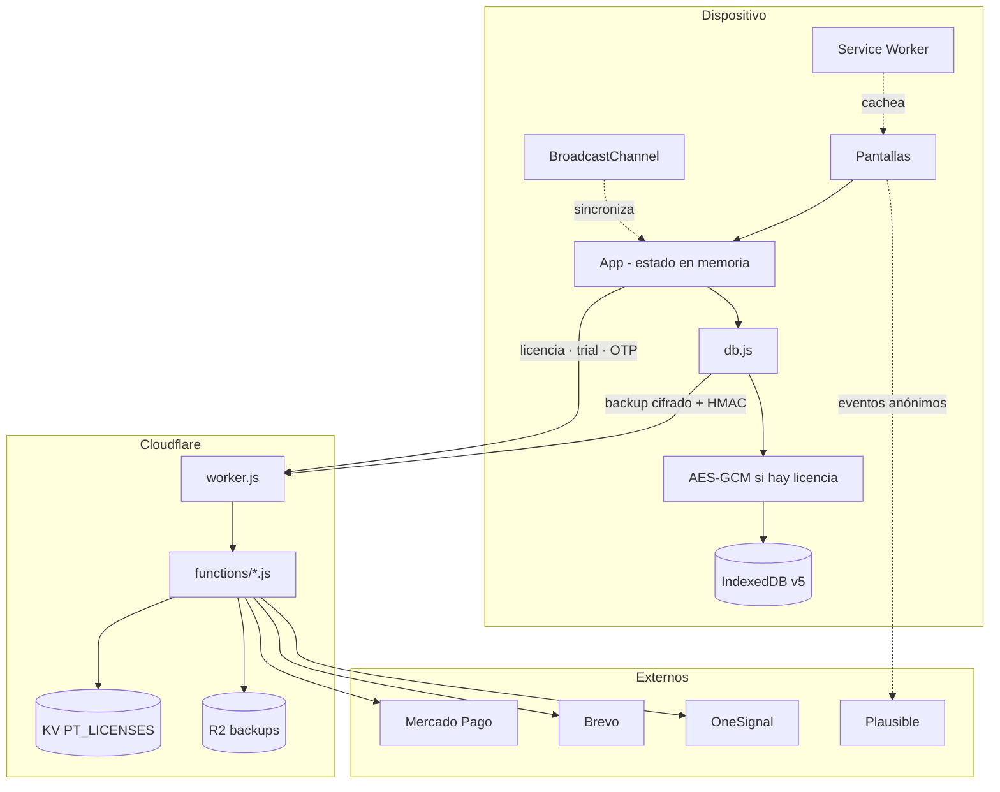

# ARCHITECTURE — Arquitectura de ParfumTrack

---

## 1. La decisión que explica todo lo demás

ParfumTrack **no usa framework ni bundler**. El resultado final es un único `index.html`
de ~6.400 líneas con todo el CSS y el JS inline.

Esto no es deuda técnica: es una decisión deliberada. El usuario objetivo abre la app en
un celular de gama baja con datos móviles caros en LATAM. Un solo archivo significa:

- **Un solo request** para tener la app entera funcionando.
- **Offline real** sin resolver dependencias entre chunks.
- **Cero superficie de build rota** — no hay transpilación que pueda fallar.

El costo era mantener un monolito de 6.400 líneas. Se resolvió con
**modularización en el fuente + concatenación en el build**: se edita en `src/` como si
fueran módulos, y `build.js` los pega en el orden correcto.

Ver [DECISIONS.md](DECISIONS.md) §D-01.

---

## 2. Patrón general

**Monolito modular con estado centralizado en memoria.**

```
┌─────────────────────────────────────────────────┐
│  App  (objeto global único)                     │
│  ├── estado: perfumes, ventas, cuotasData, …    │
│  └── métodos: aportados por src/app/*.js        │
└─────────────────────────────────────────────────┘
                      ↕
┌─────────────────────────────────────────────────┐
│  DB  (objeto global único)  — src/db.js         │
│  ├── CRUD genérico: get/add/put/delete/getAll   │
│  ├── operaciones de negocio: addVenta, …        │
│  └── capa de cifrado transparente               │
└─────────────────────────────────────────────────┘
                      ↕
┌─────────────────────────────────────────────────┐
│  IndexedDB  ParfumTrackDB v5                    │
└─────────────────────────────────────────────────┘
```

Y del lado del servidor, independiente:

```
worker.js (router)  →  functions/*.js (handlers)  →  KV / R2 / APIs externas
```

**El frontend y el backend no comparten datos del negocio.** El backend solo sabe de
licencias, pagos, emails y backups opacos. Las ventas del usuario nunca llegan al servidor
en texto plano.

---

## 3. Cómo se arma `App`

`src/index.template.html` tiene literalmente:

```js
const App = {/*PT:APP*/};
```

`build.js` reemplaza el placeholder por la concatenación de todos los `src/app/*.js`
en orden alfabético. Cada archivo empieza con propiedades o métodos sueltos:

```js
// src/app/04-stock.js
  // ====== STOCK ======
  venderDesdeStock(id) { … },
  renderStock() { … },
```

**Consecuencias que hay que tener presentes:**

1. **Todos los archivos comparten el mismo `this`.** `04-stock.js` puede llamar
   `this.toast()` que está definido en `11-utils.js`. No hay imports.
2. **No puede haber nombres de método duplicados** entre archivos — el último gana,
   silenciosamente.
3. **No se pueden usar `import`/`export`** en `src/app/` ni en `src/db.js`.
4. **El orden alfabético importa** solo para propiedades que se evalúan al definirse.
   Los métodos se pueden llamar entre sí sin importar el orden.
5. `15-encryption.js` es la excepción: define `const ENCRYPTION = {…}` y se inyecta en su
   propio placeholder, **antes** de `App`, porque `DB` lo necesita.

---

## 4. Gestión del estado

No hay store, ni observables, ni reactividad. El estado es **8 arrays planos** en `App`,
declarados en `00-core.js:2-16`:

```js
perfumes: []      ventas: []        cuotasData: []    pedidosData: []
cajaData: []      gastosData: []    comprasData: []   reservasData: []
```

Más flags de UI: `currentScreen`, `formaPago`, `stockFilter`, `pedidosFilter`,
`cajaTipo`, `gastoCat`.

### El ciclo completo de una mutación



**`loadData()` recarga TODO, siempre.** No hay actualización incremental.
Es deliberadamente simple: con los volúmenes reales (medidos hasta 2000 ventas) la
recarga completa tarda menos que el riesgo de un estado parcialmente desincronizado.
Ver [PERFORMANCE.md](PERFORMANCE.md).

### Nada derivado se persiste

Ganancia, totales, rankings, deudores, clientes, alertas de stock y recordatorios se
**recalculan en cada render** desde `App.ventas` / `App.cuotasData`. No hay campos
"total" guardados que puedan quedar viejos.

La única excepción intencional: `perfumes[].stock`, que sí es estado persistido porque
representa un hecho físico (cuántos frascos hay), no un cálculo.

---

## 5. Render

Todo el render vive en `02-render.js` (831 líneas). El patrón es siempre el mismo:
**construir un string de HTML y asignarlo a `.innerHTML`**.

```js
container.innerHTML = items.map(x => `<div>${this.esc(x.nombre)}</div>`).join('');
```

`this.esc()` es obligatorio para cualquier dato del usuario. Ver [SECURITY.md](SECURITY.md).

### `renderAll()` rinde solo lo visible

```js
renderAll() {
  const actual = this.currentScreen;
  if (actual === 'inicio') this.renderDashboard();
  else if (actual === 'cuotas') this.renderCuotas();
  // …
}
```

Rendir las 17 pantallas en cada cambio era el cuello de botella original.

### Debounce de 100 ms

`renderAll()` pasa por `debounce()`. **Esto rompe los tests que leen el DOM enseguida** —
por eso los tests llaman `App.renderDashboard()` directo. Ver [TESTING.md](TESTING.md).

### Paginado

Las dos listas que pueden crecer sin techo paginan de a 30/50:

| Lista | Estado | Método |
|---|---|---|
| Ventas | `_ventasVisibles` / `_VENTAS_PAGINA` | `verMasVentas()` |
| Cuotas | `_cuotasVisibles` / `_CUOTAS_PAGINA` | `verMasCuotas()` |

Los dos aceptan `render*(reset = true)`: al entrar a la pantalla se resetea el paginado;
al tocar "Ver más" se llama con `false` para acumular.

**Los totales siempre se calculan sobre el conjunto completo, no sobre lo visible.**

---

## 6. Comunicación entre módulos

No hay bus de eventos ni pub/sub. Tres mecanismos, en orden de frecuencia:

### a) Llamada directa a `this.metodo()`
El 95 % de los casos. Todos los módulos son el mismo objeto.

### b) Delegación de eventos en `document`
`00-core.js:_initEventDelegation()` intercepta clicks en `document` para dos casos donde
el handler tiene que venir del dato y no del HTML:

```js
.btn-whatsapp[data-msg]      → mensaje en base64 (UTF-8-safe, soporta emojis)
.btn-pay[data-cuota-id]      → id JSON percent-encoded (tolera ids string y numéricos)
```

Se hizo así **para no meter datos del usuario dentro de un atributo `onclick`** — eso era
una vía de XSS. Ver [BUG_HISTORY.md](BUG_HISTORY.md) §BUG-02.

### c) `BroadcastChannel` entre pestañas
`_initTabSync()` abre el canal `pt_sync`. Cuando una pestaña escribe, manda
`data_changed`; las otras hacen `loadData()` + `renderAll()`.

> ⚠️ Esto sincroniza *después* de escribir. **No hay locking**: dos pestañas escribiendo
> el mismo registro simultáneamente pueden pisarse. Riesgo conocido y no cubierto por
> tests — ver [TODO.md](TODO.md).

---

## 7. Inicialización

`App.init()` (`00-core.js:18`) es un wrapper con `try/catch/finally`:

```js
async init() {
  try        { await this._initInterno(); }
  catch (e)  { this._mostrarErrorArranque(e); }
  finally    { this._ocultarSplash(); }   // ← en finally, a propósito
}
```

El `finally` es importante: si IndexedDB falla (modo privado, disco lleno), el splash se
saca igual y el usuario ve una pantalla de error con un botón de reintentar, en vez de
quedarse mirando el logo para siempre.

### Orden de `_initInterno()` y por qué

| Paso | Por qué va ahí |
|---|---|
| `DB.init()` | Sin base no hay nada |
| `_pedirPersistencia()` | Cuanto antes, mejor: evita que el navegador desaloje los datos |
| `DB.seedDemo()` | Solo la primera vez en la vida de la instalación |
| `dedupEncryptedRecords()` | Sana duplicados de un bug histórico del cifrado. Idempotente |
| `_fixCorruptDates()` | Migración one-time (bandera `pt_dates_fixed_v3`) |
| `_fixStringCuotaIds()` | Idempotente — los imports pueden reintroducir ids string |
| `_fixCuotasSaldadas()` | Idempotente — sana deuda fantasma |
| `loadData()` | Recién acá el estado está confiable |
| i18n · moneda · negocio · cuenta | Preferencias |
| `_initializeEncryption()` | Después de tener la cuenta cargada |
| `checkPinOnStart()` · `checkConsent()` | Gates de UI |
| `renderAll()` | Primer pintado |
| `registerSW` · `tabSync` · `autoUpdate` | Servicios de fondo, no bloquean |

**Las tres migraciones de cuotas comparten una sola lectura** (`cuotasInit`). Antes eran
3 lecturas + 3 descifrados completos de la tabla en cada arranque.

---

## 8. Capa de cifrado

Transparente para todo el código que usa `DB`. Se activa **solo si existe
`localStorage.pt_license_code`**.



**El detalle crítico:** el `id` se conserva **fuera** del payload cifrado
(`src/db.js:16-20`). Sin eso, `put()` no encontraba el registro existente y lo **insertaba
duplicado**. `dedupEncryptedRecords()` limpia los duplicados que ese bug dejó en bases
reales.

Los 8 stores de negocio se cifran. `config` no — son preferencias, y necesita ser legible
antes de que exista la clave.

---

## 9. Service Worker

`sw.js` v16. Cada versión de la app tiene su propio cache (`parfumtrack-v1.8.0`) y limpia
los anteriores en `activate`.

- **Estáticos** (`STATIC_ASSETS`): precache en `install`.
- **Navegación**: Network-First — el usuario ve la versión nueva apenas hay red.

### La trampa de `controllerchange`

El handler solo recarga **si ya había un controller**:

```js
if (ptTeniaController) location.reload();
```

Sin ese guard, `clients.claim()` en la primera visita disparaba `controllerchange` y la
app se recargaba sola apenas entrabas. Le pasaba a **cada usuario nuevo**.
Ver [BUG_HISTORY.md](BUG_HISTORY.md) §BUG-09.

Además, la recarga automática **nunca pisa un formulario en curso**
(`17-auto-update.js:_hayTrabajoEnCurso()`).

---

## 10. Arquitectura del backend

`worker.js` es un router explícito, sin framework:

```js
const POST_ROUTES = ['/send-notification', '/validate-license', …];
const GET_ROUTES  = ['/backup', '/sync', '/health', …];
```

Cada `functions/*.js` exporta `onRequestPost` / `onRequestGet`.

### Defensas aplicadas en orden, antes de cualquier handler

1. **Tamaño**: rechaza `Content-Length > 5 MB` (413).
2. **Rate limit global por IP**: 1000 req/min, contador en KV.
3. **Límite de concurrencia**: 10 simultáneas por IP en rutas críticas (429).
4. **CORS preflight**: whitelist por `ORIGIN_RE`, origen no permitido → `null`.
5. **Método**: si la ruta existe pero el método no, 405 con header `Allow`.
6. **Fallback**: cualquier otra ruta va a `env.ASSETS.fetch()`.

> ⚠️ Los rate limits del router hacen **fail-open** si KV falla (loguean un warning y
> siguen). Los rate limits de `_shared.js`, en cambio, son fail-closed. Es una
> inconsistencia real — ver [SECURITY.md](SECURITY.md).

Detalle de cada endpoint: [SERVICES.md](SERVICES.md) y [ROUTES.md](ROUTES.md).

---

## 11. Flujo de datos completo



**Lo importante:** la única flecha que lleva datos del negocio al servidor es el backup,
y va cifrado y autenticado con HMAC. El servidor no puede leerlo.

---

## 12. Qué NO hay (y es a propósito)

| No hay | Por qué |
|---|---|
| Framework (React/Vue/Svelte) | Un solo archivo, offline, celulares de gama baja |
| Bundler (Vite/Webpack) | La concatenación alcanza y no puede fallar de formas raras |
| TypeScript | El costo de build no compensa; los tests cubren los contratos |
| Router de URL | Es una PWA con bottom nav; `showScreen()` alcanza |
| Backend de datos de usuario | Privacidad y costo — los datos son del usuario, punto |
| Sistema de migraciones versionado | Las migraciones son idempotentes y corren en cada init |
| Gestión de estado reactiva | 8 arrays + `loadData()` + `renderAll()` es suficiente y auditable |
