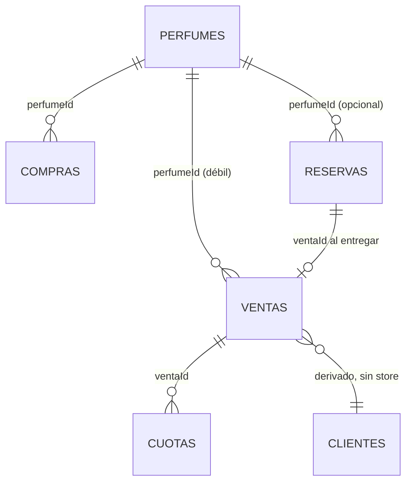

# DATABASE — Persistencia de ParfumTrack

**Base:** `ParfumTrackDB` · **Versión:** 5 · **Motor:** IndexedDB
**Esquema:** `src/index.template.html` → `openDB()` (~línea 573)
**Acceso:** exclusivamente vía `src/db.js`. Ningún módulo de UI toca IndexedDB directo.

---

## 1. Principio rector

**Los datos del usuario viven SOLO en su dispositivo.** No hay base de datos de usuarios
en el servidor. Esto es una decisión de producto y privacidad (ver [DECISIONS.md](DECISIONS.md) §D-03),
y tiene una consecuencia dura:

> Si se pierde IndexedDB, se pierde todo el historial del negocio del usuario.

Por eso existen tres defensas: `navigator.storage.persist()`, export JSON manual y backup
cifrado a R2.

---

## 2. Object stores

| Store | Cifrado | keyPath | Autoincrement | Desde |
|---|---|---|---|---|
| `perfumes` | ✅ | `id` | ✅ | v1 |
| `ventas` | ✅ | `id` | ✅ | v1 |
| `cuotas` | ✅ | `id` | ✅ | v1 |
| `config` | ❌ | `key` | ❌ | v1 |
| `pedidos` | ✅ | `id` | ✅ | v2 |
| `caja` | ✅ | `id` | ✅ | v2 |
| `gastos` | ✅ | `id` | ✅ | v3 |
| `compras` | ✅ | `id` | ✅ | **v4** |
| `reservas` | ✅ | `id` | ✅ | **v5** |

`config` es el único store **no cifrado**: guarda preferencias y tiene que ser legible
antes de que exista la clave de cifrado.

La lista autoritativa de stores cifrados está en `src/db.js:6` (`_encryptedStores`).

---

## 3. Índices

| Store | Índices |
|---|---|
| `perfumes` | `nombre` |
| `ventas` | `fecha`, `perfumeId`, `cliente` |
| `cuotas` | `ventaId`, `pagado`, `vence` |
| `pedidos` | `estado`, `fecha` |
| `caja` | `fecha`, `tipo` |
| `gastos` | `fecha` |
| `compras` | `fecha`, `perfumeId` |
| `reservas` | `fecha`, `perfumeId`, `estado` |

Ninguno es `unique`.

> ⚠️ **Los índices casi no se usan.** `loadData()` hace `getAll()` de todo y filtra en
> memoria. Los índices solo se aprovechan en `getVentasByPerfume()`, `getVentasByCliente()`,
> `getCuotasSinPagar()` y `getCajaByTipo()`. **Con datos cifrados los índices sobre campos
> cifrados no sirven** — el campo real está dentro del blob.

---

## 4. Campos por store

Los campos surgen del código de `src/db.js`. IndexedDB no impone esquema: registros viejos
pueden no tener campos nuevos. **Asumí siempre que un campo puede faltar.**

### `perfumes`
| Campo | Tipo | Notas |
|---|---|---|
| `id` | number | auto |
| `nombre` | string | |
| `precioCompra` | number | Costo de referencia. **Lo pisa `registrarCompra()`** |
| `precioVenta` | number | Precio sugerido |
| `stock` | number | 🔴 Nunca negativo |
| `foto` | string | data URL, opcional |
| `creado` | number | timestamp, lo pone `addPerfume` |

### `ventas` ⭐ la entidad central
| Campo | Tipo | Notas |
|---|---|---|
| `id` | number | auto |
| `perfume` | string | Nombre **desnormalizado** (la venta sobrevive al borrado del perfume) |
| `perfumeId` | number \| `''` | Vacío = venta libre o importada de Excel |
| `cantidad` | number | F1. Ausente en ventas viejas ⇒ vale **1** |
| `precioVenta` | number | 🔴 **TOTAL** (unitario × cantidad) |
| `precioCompra` | number | 🔴 **TOTAL** |
| `precioUnitario` | number | Para reabrir el formulario |
| `precioCompraUnitario` | number | idem |
| `precioOriginal` | number | Antes del descuento |
| `descuento` | number | 0–100 |
| `cliente` · `vendedor` · `proveedor` | string | |
| `formaPago` | `'contado'` \| `'cuotas'` | |
| `numCuotas` | number | 1–12 |
| `fecha` | number | timestamp |
| `nota` | string | |
| `stockDescontado` | boolean | Si esta venta movió inventario |
| `unidadesDescontadas` | number | 🔴 Cuántas exactamente. Sin esto, borrar una venta hecha con stock 0 inventaba stock |
| `reservaId` | number | Si vino de una reserva (F5) |
| **Campos de devolución (F3)** | | Solo si `devuelta` |
| `devuelta` | `true` | |
| `fechaDevolucion` | number | |
| `motivoDevolucion` · `notaDevolucion` | string | |
| `unidadesRepuestas` | number | |
| `cuotasCanceladas` | number | |
| `montoADevolver` | number | Lo efectivamente cobrado |

### `cuotas`
| Campo | Tipo | Notas |
|---|---|---|
| `id` | number | auto. Los imports pueden meter strings → `_fixStringCuotaIds()` |
| `ventaId` | number | 🔴 Sin esto no se sabe de qué venta es |
| `perfume` · `cliente` | string | Desnormalizados |
| `numero` / `total` | number | "cuota 2 de 3" |
| `monto` | number | De ESTA cuota |
| `montoTotal` | number | De la venta entera |
| `pagado` | boolean | |
| `montoPagado` | number | 🔴 Nunca mayor a `monto` |
| `pagos` | array | `[{ monto, fecha }]` — pagos parciales |
| `vence` | number | timestamp |
| `fechaPago` | number | |

**Invariante:** las cuotas de una venta suman exactamente su `precioVenta` (±1,5 por
redondeo). La última absorbe el resto. Excepción: una venta **devuelta** tiene menos cuotas
(se cancelaron las impagas), así que su suma es *menor*.

### `compras` (F4)
`id`, `perfumeId`, `perfume`, `cantidad`, `precioUnitario`, `total` (= unitario × cantidad),
`proveedor`, `nota`, `costoActualizado` (bool), `fecha`.

### `reservas` (F5)
`id`, `cliente`, `perfume`, `perfumeId`, `cantidad`, `precioAcordado`, `total`, `sena`
(🔴 nunca > `total`), `estado` (`pendiente`|`entregada`|`cancelada`), `fecha`, `vendedor`,
`proveedor`, `fechaEntrega`, `ventaId`, `fechaCancelacion`, `senaDevuelta`, `motivoCancelacion`.

### `pedidos`
`id`, `estado` (`pendiente`|`enviado`), `fecha`, `fechaEnvio`, más los perfumes y cantidades
del pedido.

### `caja`
`id`, `tipo` (`entrada`|`salida`), `fecha`, monto, concepto.

### `gastos`
`id`, `fecha`, categoría, monto.

### `config`
`key` (keyPath) + `value`. Moneda, nombre del negocio, idioma, etc. **No cifrado.**

---

## 5. Relaciones



**Todas las relaciones son débiles** — no hay foreign keys ni cascadas del motor. La
integridad se mantiene en `db.js` a mano:

- Borrar una venta en cuotas borra sus cuotas (`deleteVenta`).
- La venta guarda `perfume` como **string** además de `perfumeId`: si borrás el perfume,
  la venta sigue siendo legible.
- Una venta con `perfumeId: ''` es válida (venta libre o import de Excel).

**Clientes no tienen store.** Se derivan de ventas + cuotas en `18-clientes.js`.

---

## 6. Migraciones

### Migraciones de esquema (`onupgradeneeded`)

**🔴 Son ADITIVAS. Nunca `deleteObjectStore`, nunca cambiar un `keyPath`.**

El patrón es guarda por existencia, no por número de versión:

```js
if (!d.objectStoreNames.contains('compras')) {
  const s = d.createObjectStore('compras', { keyPath: 'id', autoIncrement: true });
  s.createIndex('fecha', 'fecha', { unique: false });
}
```

Esto hace que un salto de v3 → v5 cree `compras` **y** `reservas` en una sola pasada. Hay
un test E2E que abre una base v3 real y verifica que llegue a ≥5 con los datos intactos.

| Versión | Agrega |
|---|---|
| v1 | `perfumes`, `ventas`, `cuotas`, `config` |
| v2 | `pedidos`, `caja` |
| v3 | `gastos` |
| **v4** | `compras` (F4) |
| **v5** | `reservas` (F5) |

### Migraciones de datos (en `init()`, no en `onupgradeneeded`)

| Función | Tipo | Qué sana |
|---|---|---|
| `DB.dedupEncryptedRecords()` | idempotente | Duplicados del bug histórico de `put()` + cifrado |
| `_fixCorruptDates()` | **one-time** (`pt_dates_fixed_v3`) | Fechas string o inválidas |
| `_fixStringCuotaIds()` | idempotente | Ids string de cuotas (los imports los reintroducen) |
| `_fixCuotasSaldadas()` | idempotente | `montoPagado > monto`, cuotas cubiertas sin marcar |

**Por qué idempotentes y no one-time:** un import puede reintroducir el problema en
cualquier momento. Solo `_fixCorruptDates()` usa bandera, porque recorre todas las ventas
y es cara.

**🟠 `_fixCuotasSaldadas()` condona deuda.** Marca cuotas pendientes como pagadas cuando el
total de la venta ya está cubierto. Salta a propósito las cuotas **sin `ventaId`**:
agruparlas todas bajo `undefined` mezclaría deudas de clientes distintos y podría borrar
plata que el usuario sí tiene que cobrar.

---

## 7. Cifrado

Se activa **solo si existe `localStorage.pt_license_code`**.

```js
// En disco, un registro cifrado:
{ _encrypted: "<blob AES-GCM>", _v: 1, id: 42 }
```

**🔴 El `id` va FUERA del payload cifrado** (`db.js:16-20`). Sin eso, `put()` no encontraba
el registro existente y lo **insertaba duplicado**. Al descifrar, la clave real del store
es la autoridad y sana el `id` del payload (`db.js:37`).

`dedupEncryptedRecords()` limpia los duplicados que ese bug dejó en bases reales: agrupa
por el `id` interno, se queda con la escritura más reciente y borra las copias. Idempotente.

**Rendimiento:** con licencia, cada registro se descifra por separado. Medido con 2000
ventas + 1500 cuotas: arranque de ~970 ms (vs ~1100 ms sin cifrar). Ver [PERFORMANCE.md](PERFORMANCE.md).

---

## 8. 🔴 Agregar un object store — checklist

Si te salteás un paso, **un restore borra los datos de ese store**.

1. **`src/index.template.html`** → `openDB()`: subir `DB_VERSION` y agregar el bloque
   `if (!d.objectStoreNames.contains('nuevo'))`.
2. **`src/db.js:6`** → agregarlo a `_encryptedStores` (salvo que sea config-like).
3. **`src/app/00-core.js`** → `loadData()`: sumar `this.nuevoData = await DB.getNuevo()`.
4. **`src/app/10-data-management.js`** → agregarlo a **las 5 listas `const stores = [...]`**
   (líneas ~96, 197, 211, 250, 806).
   *(La de la línea 197 es `_assertRestorable` y no lleva `config`.)*
5. **`src/app/00-core.js`** → declarar el array en el estado inicial.
6. **Test**: hay una regresión que verifica las listas de stores. Actualizala.

---

## 9. Backup y restore

| Vía | Qué hace | Peligro |
|---|---|---|
| Export JSON (`exportData`) | Vuelca los 9 stores a un archivo | — |
| Import JSON (`_restoreData`) | 🔴 **REEMPLAZA todo** | Destructivo |
| Importar Excel (`26-importar-excel.js`) | **AGREGA** sin borrar | Duplicados si se importa dos veces |
| Backup a R2 (`backupToCloud`) | Sube cifrado, con HMAC | Requiere licencia |
| Restore de R2 (`restoreFromCloud`) | 🔴 **REEMPLAZA todo** | Destructivo |

`_normalizeBackupData()` es la línea de defensa: tolera backups viejos, campos faltantes y
formatos de fecha raros. `_assertRestorable()` frena un restore que dejaría la base
inconsistente.

Hay un test de ida y vuelta que compara **campo por campo** antes y después del backup.

---

## 10. Datos de demo

`DB.seedDemo()` siembra 8 perfumes y 13 ventas — **una sola vez en la vida de la
instalación**, controlado por `localStorage.pt_demo_seeded`.

Sin esa bandera, borrar todos los datos hacía que al reabrir la app **reaparecieran los
datos de demo mezclados con los reales**. Si ya hay datos del usuario, marca la bandera y
no toca nada.

> Los tests E2E esperan `pt_demo_seeded === '1'` como señal de que la app terminó de
> arrancar. Si cambiás esto, se rompen todos.
