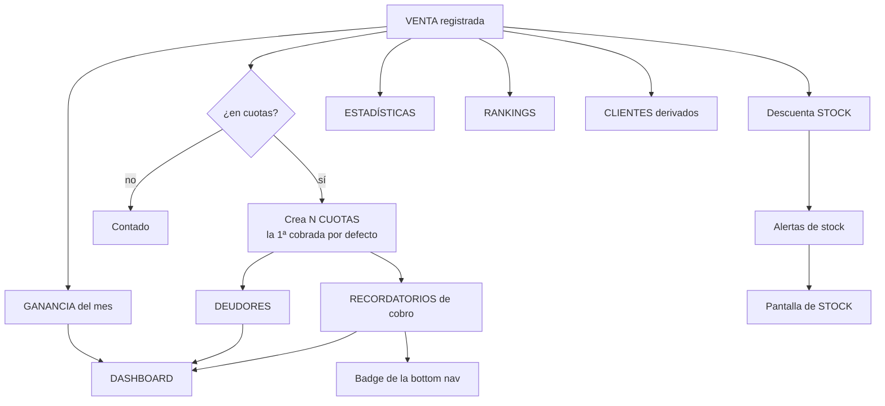
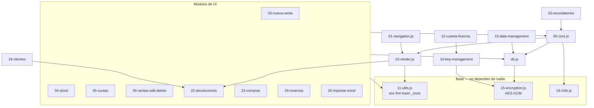
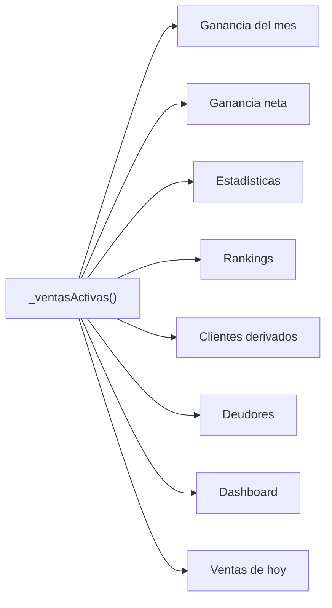
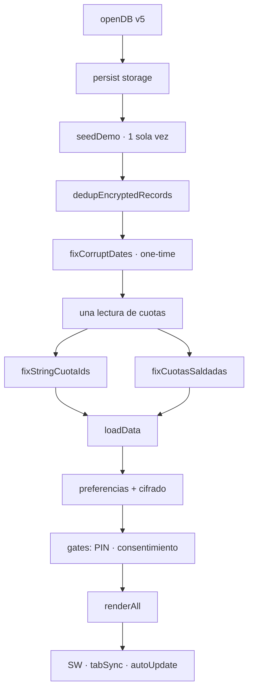
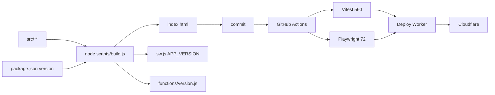
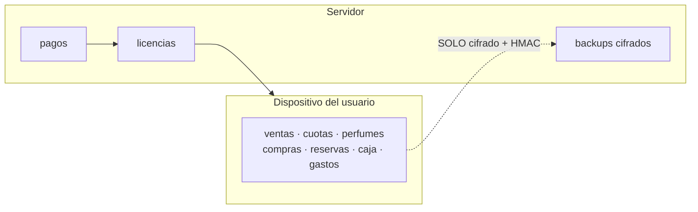

# KNOWLEDGE_GRAPH — Qué afecta a qué

**Para qué sirve este archivo.** Antes de tocar algo, mirá qué cuelga de eso. La mayoría de
los bugs de esta app no son "la función está mal": son "cambié X y no me di cuenta de que
Y dependía de X".

---

## 1. El grafo central: una venta



**Leelo así:** tocar cómo se guarda una venta afecta —como mínimo— stock, cuotas,
ganancia, estadísticas, rankings, clientes, deudores, recordatorios, el badge y el
dashboard. **Todo eso es derivado y se recalcula**; ninguno se persiste.

---

## 2. Impacto de cada operación

| Operación | Stock | Cuotas | Ganancia | Clientes | Otros |
|---|---|---|---|---|---|
| `addVenta` | ↓ descuenta | crea N | ↑ suma | + aparece | recordatorios, rankings |
| `updateVenta` | ⟳ solo si cambió perfume/cantidad | — | ⟳ recalcula | ⟳ | — |
| `deleteVenta` | ↑ devuelve exacto | **borra** | ↓ resta | − puede desaparecer | — |
| `devolverVenta` | ↑ repone (opcional) | cancela impagas | ↓ deja de contar | − puede desaparecer | marca `devuelta` |
| `revertirDevolucion` | ↓ vuelve a descontar | **recrea** las canceladas | ↑ vuelve a contar | + reaparece | — |
| `pagarCuota` | — | ↓ baja la deuda | — | ⟳ saldo | recordatorios, badge |
| `registrarCompra` | ↑ suma | — | ⟳ **cambia `precioCompra`** | — | 🟠 afecta la ganancia futura |
| `eliminarCompra` | ↓ resta (nunca negativo) | — | — | — | no revierte el costo |
| `addReserva` | 🔵 **no toca** | — | — | — | lista de espera |
| `entregarReserva` | ↓ vía `addVenta` | según la venta | ↑ suma | + aparece | seña no se re-suma |
| `cancelarReserva` | — | — | — | — | registra si se devolvió la seña |
| `addPerfume` | define stock inicial | — | — | — | — |
| `deletePerfume` | — | — | — | — | 🔵 las ventas sobreviven (`perfume` es string) |
| `addGasto` | — | — | ↓ **ganancia neta** | — | — |
| `addCaja` | — | — | 🔵 independiente | — | — |
| `addPedido` | 🔵 **no toca** | — | — | — | ≠ compras |

**Los tres 🔵 que más se confunden:**
- Una **reserva** no descuenta stock hasta entregarse.
- Un **pedido** al proveedor no toca el stock; la reposición real es una **compra**.
- Borrar un **perfume** no rompe las ventas: guardan el nombre como string.

---

## 3. Grafo de dependencias del código



### Los cuatro nodos más peligrosos

| Nodo | De quién cuelga | Por qué es peligroso |
|---|---|---|
| **`11-utils.js`** | Todos | `esc()` es la defensa XSS; `_once()` es la anti doble-tap. Romperlos rompe todo |
| **`db.js`** | Todos los que persisten | Un error acá corrompe datos, no solo la UI |
| **`_ventasActivas()`** (en `22-devoluciones`) | Toda agregación de plata | Si algo no la usa, cuenta ventas devueltas |
| **`15-encryption.js`** | `db.js` | Un cambio puede volver **ilegibles** datos de usuarios reales |

---

## 4. `_ventasActivas()` — el nodo crítico



Definida en `22-devoluciones.js`, consumida desde todos lados.

🔴 **Cualquier `this.ventas.filter(` en `02-render.js` es un bug.** Hay un test que falla
si aparece esa cadena.

---

## 5. Cadenas de efecto en cascada

### Cadena de la plata
```
precio de venta → ganancia bruta → (− gastos) → ganancia neta → dashboard
                → estadísticas → rankings
                → cuotas → deuda del cliente → recordatorios → badge
```
🔴 Un error acá **no lanza ninguna excepción**: muestra un número mal. Es la clase de bug
más cara de esta app, y es la razón de que exista el fuzzer.

### Cadena del stock
```
stock inicial → (− ventas) → (+ devoluciones) → (+ compras) → (− reservas entregadas)
             → alertas de agotados → resumen colapsable → pantalla de stock
```

### Cadena de la identidad del cliente
```
nombre escrito → _clienteKey() normaliza → agrupa ventas + cuotas
              → cliente derivado → lista → ficha → total comprado / saldo
```
🟡 "Ana" y "ana " son el mismo cliente; "Ana Gómez" y "Ana" no.

---

## 6. Cadena del arranque



🔴 **Todo lo que agregues acá le pega a todos los usuarios en cada apertura.** Medí antes.

---

## 7. Cadena de build y deploy



🔴 **Si tocás `src/` y no corrés `build.js`, tu cambio no llega a producción** — y CI falla
por drift entre `src/` e `index.html`.

---

## 8. Grafo de "si toco X, revisá Y"

| Si tocás… | Revisá también |
|---|---|
| `db.js addVenta` | stock, cuotas, ganancia, tests f1/f3/fuzz |
| `db.js devolverVenta` | `revertirDevolucion` (son espejo), clientes, deudores |
| `_ventasActivas()` | **todas** las agregaciones de `02-render.js` y `18-clientes.js` |
| `02-render.js renderCuotas` | el total adeudado, el paginado, el `sort` sin trabajo adentro |
| `11-utils.js esc()` | seguridad XSS de toda la app |
| `11-utils.js _once()` | todos los guardados async |
| `15-encryption.js` | **datos de usuarios reales**. Migración + test de ida y vuelta |
| `openDB()` | las 5 listas de stores, `_encryptedStores`, `loadData()` |
| `showScreen()` | que cada pantalla nueva tenga su `if` de render |
| `worker.js` rutas | CORS, rate limit, tests de worker |
| `_shared.js` | los 10 endpoints a la vez |
| `sw.js` | cacheo, `STATIC_ASSETS`, guard de `controllerchange` |
| `package.json` version | nada: `build.js` propaga sola |
| Un nombre de método público | buscá el string en `src/screens/` y `src/index.template.html` |

---

## 9. Datos que viajan (y los que no)



🔴 **La única flecha que lleva datos del negocio al servidor es el backup, y va cifrado del
lado del cliente.** El servidor no puede leerlo. Cualquier feature que rompa esto rompe la
promesa de privacidad del producto (D-03).
