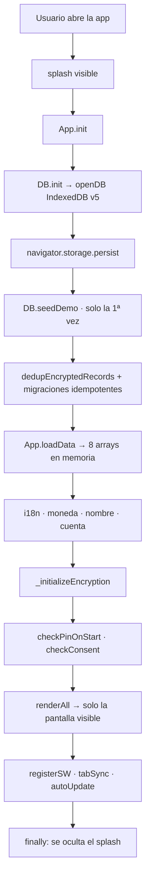
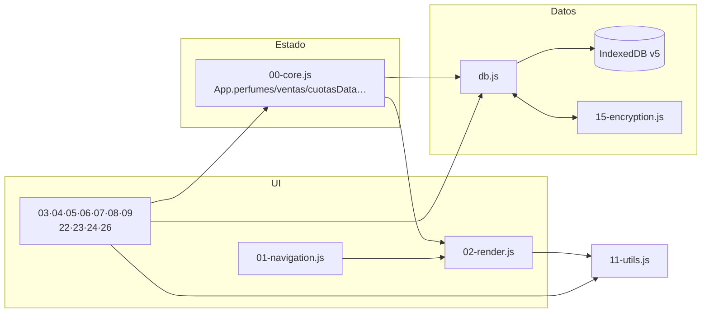
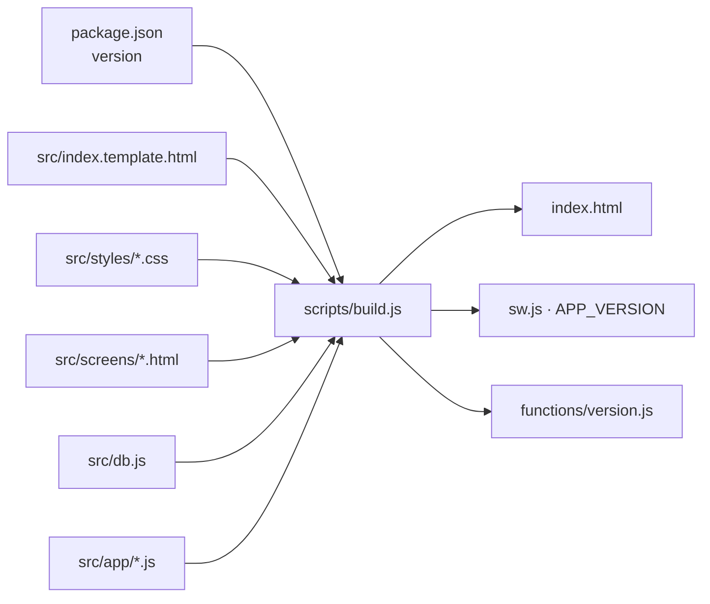

# PROJECT_MAP — Índice del proyecto

Mapa completo de ParfumTrack. Usalo para **ubicar** qué archivo tocar; para entender el
módulo una vez ubicado, andá a [MODULES.md](MODULES.md).

---

## 1. Árbol del repositorio

```
ParfumTrack/
│
├── src/                          ← FUENTE REAL de la app. Editá SIEMPRE acá.
│   ├── index.template.html       ← esqueleto + IndexedDB (openDB/tx/reqP) + nav
│   ├── db.js                     ← capa de datos (703 líneas)
│   ├── app/                      ← 26 módulos que arman el objeto `App`
│   ├── screens/                  ← 17 pantallas HTML
│   ├── styles/                   ← 27 hojas CSS numeradas
│   └── landing/                  ← fuente de landing.html
│
├── index.html                    ← ⚠️ GENERADO (~6.400 líneas). NO EDITAR.
├── landing.html                  ← ⚠️ GENERADO por scripts/build-landing.js
│
├── scripts/
│   ├── build.js                  ← src/ → index.html + sincroniza versión
│   ├── build-landing.js          ← src/landing/ → landing.html
│   ├── build-og.js               ← imagen Open Graph 1200x630 vía Chromium
│   └── generate-license.js       ← genera licencias propietarias en KV
│
├── worker.js                     ← router de Cloudflare Workers (232 líneas)
├── functions/                    ← handlers del backend
├── sw.js                         ← Service Worker v16 (191 líneas)
├── manifest.json                 ← manifest PWA (shortcuts + screenshots)
├── wrangler.jsonc                ← config Cloudflare (KV, R2, vars, assets)
├── _headers                      ← CSP, HSTS, X-Frame-Options
├── package.json                  ← ⚠️ ÚNICA fuente de verdad de la versión
│
├── tests/                        ← 47 archivos (Vitest + Playwright)
├── AI/                           ← esta base de conocimiento
├── CLAUDE.md                     ← reglas operativas del proyecto
│
├── terminos.html · privacidad.html · checkout-success.html · checkout-pending.html
├── fonts/ · img/ · screenshot-*.jpg
└── standalone/                   ← reportes de auditoría (excluidos del deploy)
```

---

## 2. Módulos de `src/app/` (orden de concatenación = orden alfabético)

El prefijo numérico **define el orden en que se concatenan**. Todos aportan métodos al
mismo objeto global `App`.

| # | Archivo | Líneas | Responsabilidad |
|---|---|---|---|
| 00 | `00-core.js` | 307 | Estado global, `init()`, migraciones de arranque, `loadData()`, splash, CSRF, sync entre pestañas |
| 01 | `01-navigation.js` | 138 | `showScreen()`, modal de demo, fullscreen del video |
| 02 | `02-render.js` | 831 | **Todo el render.** Dashboard, ventas, stock, cuotas, stats, rankings |
| 03 | `03-nueva-venta.js` | 496 | Formulario de alta de venta, ganancia en vivo, cantidad (F1) |
| 04 | `04-stock.js` | 255 | Alta/edición de perfumes, filtros, foto |
| 05 | `05-cuotas.js` | 78 | Modal de pago de cuota |
| 06 | `06-ventas-edit-delete.js` | 181 | Editar y borrar ventas, con validaciones |
| 07 | `07-pedidos.js` | 374 | Pedidos al proveedor |
| 08 | `08-caja.js` | 79 | Movimientos de caja |
| 09 | `09-gastos.js` | 120 | Gastos por categoría |
| 10 | `10-data-management.js` | 813 | Export/import JSON, PDF, Excel, catálogo WA, backup/restore R2 |
| 11 | `11-utils.js` | 179 | `fmt()`, `esc()`, `toast()`, `parseMonto()`, `_once()`, `appConfirm()` |
| 12 | `12-cuenta-licencia.js` | 329 | Trial, OTP, activación de licencia, device id |
| 13 | `13-onboarding.js` | 68 | Consentimiento y onboarding inicial |
| 14 | `14-pin-lock.js` | 127 | Bloqueo por PIN (SHA-256) |
| 15 | `15-encryption.js` | 336 | **Objeto `ENCRYPTION`** (no `App`). AES-GCM + PBKDF2 |
| 16 | `16-key-management.js` | 82 | Master key protegida por PIN |
| 17 | `17-auto-update.js` | 152 | Chequeo de versión cada 5 min, recarga segura |
| 18 | `18-clientes.js` | 134 | Clientes derivados de ventas + cuotas |
| 19 | `19-i18n.js` | 64 | Base de i18n (`t()`); español es el idioma fuente |
| 20 | `20-recordatorios.js` | 146 | Recordatorios de cobro en el dashboard (F2) |
| 22 | `22-devoluciones.js` | 147 | Devoluciones y cambios (F3) |
| 23 | `23-compras.js` | 164 | Compras al proveedor (F4) |
| 24 | `24-reservas.js` | 295 | Señas y encargos (F5) |
| 26 | `26-importar-excel.js` | 438 | Importador de planillas .xlsx/.csv/.ods |
| 27 | `27-negocio.js` | 210 | Perfil del negocio: datos + logo que ve el cliente |

> **Nota:** faltan los números 21 y 25. No es un error — se reservaron y no se usaron.
> `15-encryption.js` se inyecta en un placeholder aparte (`/*PT:ENCRYPTION*/`) porque
> define un objeto propio, no métodos de `App`.

---

## 3. Pantallas (`src/screens/`)

Cada archivo es un `<div id="screen-{nombre}" class="screen">` que `build.js` inyecta en
el marcador `<!--PT:SCREEN:{nombre}-->` del template.

| Pantalla | En bottom nav | Descripción |
|---|---|---|
| `inicio.html` | ✅ | Dashboard: ganancia del mes, recordatorios, ventas recientes |
| `nueva-venta.html` | ✅ | Alta de venta (la pantalla más usada) |
| `stock.html` | ✅ | Inventario + alertas de agotados |
| `cuotas.html` | ✅ | Cobros pendientes y deudores |
| `mas.html` | ✅ | Menú a todo lo demás |
| `ventas-all.html` | | Historial completo, con búsqueda y paginado |
| `stats.html` | | Estadísticas y rankings (Chart.js lazy) |
| `clientes.html` | | Lista de clientes (derivada) |
| `cliente-detalle.html` | | Ficha de un cliente |
| `pedidos.html` · `nuevo-pedido.html` · `pedido-detalle.html` | | Pedidos al proveedor |
| `caja.html` | | Movimientos de caja |
| `gastos.html` | | Gastos |
| `reservas.html` | | Señas y encargos (F5) |
| `catalogo.html` | | Armado del catálogo para WhatsApp |
| `cuenta.html` | | **Perfil del negocio (datos + logo)**, licencia, suscripción, backup, PIN |

Navegación completa: [ROUTES.md](ROUTES.md).

---

## 4. Backend (`functions/`)

| Archivo | Líneas | Qué hace |
|---|---|---|
| `_shared.js` | 522 | **Utilidades comunes.** CORS, rate limiting, CSRF, HMAC, logging, cifrado de secrets |
| `_email-templates.js` | 219 | Plantillas HTML de email |
| `trial.js` | 386 | Registro por OTP + ancla de trial |
| `validate-license.js` | 214 | Validación de licencia con ECDSA |
| `backup.js` | 153 | Backup a R2 con HMAC (GET/POST) |
| `sync.js` | 164 | Sync multi-dispositivo con HMAC (GET/POST) |
| `send-email.js` | 347 | Email transaccional vía Brevo |
| `send-notification.js` | 117 | Push vía OneSignal |
| `mp-create-preference.js` | 116 | Crea preferencia de pago en Mercado Pago |
| `mp-webhook.js` | 512 | Webhook de pagos MP (el archivo más grande del backend) |
| `mp-subscription-status.js` | 65 | Estado de suscripción |
| `mp-payment-status.js` | 117 | Estado de un pago |
| `generate-owner-license.js` | 142 | Genera licencias propietarias |
| `debug-license.js` | 59 | Diagnóstico de licencias |
| `version.js` | 42 | Versión del app para el auto-update. Sin rate limit propio a propósito |

Detalle de cada servicio: [SERVICES.md](SERVICES.md).

---

## 5. Persistencia

### Local — IndexedDB `ParfumTrackDB` v5

| Store | Cifrado | keyPath | Índices |
|---|---|---|---|
| `perfumes` | ✅ | `id` auto | `nombre` |
| `ventas` | ✅ | `id` auto | `fecha`, `perfumeId`, `cliente` |
| `cuotas` | ✅ | `id` auto | `ventaId`, `pagado`, `vence` |
| `pedidos` | ✅ | `id` auto | `estado`, `fecha` |
| `caja` | ✅ | `id` auto | `fecha`, `tipo` |
| `gastos` | ✅ | `id` auto | `fecha` |
| `compras` | ✅ | `id` auto | `fecha`, `perfumeId` |
| `reservas` | ✅ | `id` auto | `fecha`, `perfumeId`, `estado` |
| `config` | ❌ | `key` | — |

El esquema se define en `src/index.template.html` (`openDB()`, ~línea 573).
Detalle completo: [DATABASE.md](DATABASE.md).

### Local — localStorage (banderas, nunca datos del negocio)

| Clave | Para qué |
|---|---|
| `pt_license_code` | Código de licencia. **Su presencia activa el cifrado.** |
| `pt_demo_seeded` | Ya se sembró el demo (una sola vez en la vida de la instalación) |
| `pt_onboarded` · `pt_consent_accepted` | Onboarding y consentimiento |
| `pt_pin` | Hash SHA-256 del PIN |
| `pt_device_id` | Identificador del dispositivo |
| `pt_csrf_token` | Token CSRF |
| `pt_pending_license` | Licencia pendiente de activar (deep link `?activate=`) |
| `pt_dates_fixed_v3` | Bandera de migración one-time de fechas corruptas |

### Servidor

- **KV `PT_LICENSES`** — licencias, anclas de trial, contadores de rate limit, dedup de webhooks.
- **R2 `parfumtrack-backups`** — backups del usuario, autenticados con HMAC.

---

## 6. Flujo general de la app



**Punto clave:** el splash se oculta en el `finally` de `init()`. Si el arranque falla,
se muestra la pantalla de error en vez de dejar el logo tapando todo.

---

## 7. Relaciones entre módulos



**Regla de oro:** los módulos de UI **nunca** escriben en IndexedDB directo. Pasan por
`DB.*`, después llaman `App.loadData()` y recién ahí renderizan.

Grafo de negocio (qué cambia qué): [KNOWLEDGE_GRAPH.md](KNOWLEDGE_GRAPH.md).

---

## 8. Pipeline de build



`build.js` falla ruidosamente si queda un placeholder sin resolver o si falta el marcador
de una pantalla. Es intencional: es preferible romper el build a publicar un HTML a medias.

---

## 9. Dónde tocar según la tarea

| Querés… | Archivo |
|---|---|
| Cambiar cómo se ve el dashboard | `src/app/02-render.js` → `renderDashboard()` |
| Agregar un campo a la venta | `src/app/03-nueva-venta.js` + `src/db.js` + `src/screens/nueva-venta.html` |
| Cambiar la lógica de stock | `src/db.js` (`addVenta`, `updateVenta`, `deleteVenta`) |
| Agregar un object store | `src/index.template.html` + `src/db.js` + `10-data-management.js` (5 listas) |
| Tocar el cálculo de ganancia | `src/app/02-render.js` (`_ventasActivas()`) |
| Agregar un endpoint | `worker.js` (importar + `POST_ROUTES`/`GET_ROUTES`) + `functions/` |
| Cambiar estilos | `src/styles/NN-*.css` (numerados por área) |
| Cambiar la versión | `package.json` **y nada más** |
| Tocar el cacheo offline | `sw.js` (`STATIC_ASSETS`) |
| Tocar seguridad del backend | `functions/_shared.js` |
