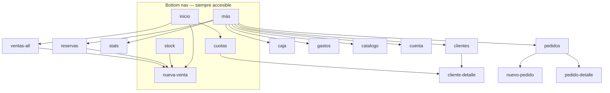
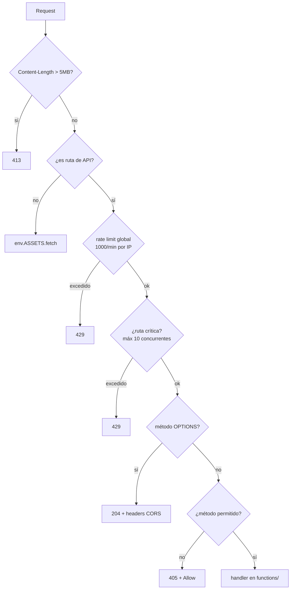

# ROUTES — Navegación y endpoints

Dos sistemas de rutas independientes: la **navegación interna** de la PWA (sin URL) y las
**rutas HTTP** del Worker.

---

## PARTE 1 — Navegación de la app

### No hay router de URL

ParfumTrack **no usa History API ni hash routing**. La URL nunca cambia. La navegación es
`showScreen(nombre)`: alterna la clase `.active` entre los `<div class="screen">`.

**Por qué:** es una PWA con bottom nav que se usa como app nativa. Un router agregaba
complejidad sin resolver ningún problema real.

**Consecuencias:**
- No se puede compartir un link a una pantalla.
- El botón "atrás" del navegador sale de la app en vez de volver una pantalla.
- Recargar siempre vuelve a `inicio`.

Ver [DECISIONS.md](DECISIONS.md) §D-06.

### Contrato de `showScreen(name)`

```js
showScreen(name) {
  // 1. saca .active de todas, se la pone a #screen-{name}
  // 2. actualiza el estado visual de la bottom nav
  // 3. this.currentScreen = name
  // 4. dispara el render de esa pantalla
}
```

🔴 **El paso 4 es un `if` por pantalla.** Si agregás una pantalla y no agregás su línea,
la pantalla aparece vacía sin ningún error.

### Tabla de pantallas

| Nombre | Bottom nav | Render que dispara | Módulo |
|---|---|---|---|
| `inicio` | ✅ | `renderDashboard()` | `02-render.js` |
| `nueva-venta` | ✅ | `resetVentaForm()` | `03-nueva-venta.js` |
| `stock` | ✅ | `renderStock()` | `02-render.js` |
| `cuotas` | ✅ | `renderCuotas()` | `02-render.js` |
| `mas` | ✅ | — (estática) | — |
| `ventas-all` | | `renderAllVentas()` | `02-render.js` |
| `stats` | | `renderStats()` | `02-render.js` |
| `clientes` | | `renderClientes()` | `18-clientes.js` |
| `cliente-detalle` | | `renderClienteDetalle()` | `18-clientes.js` |
| `pedidos` | | `renderPedidos()` + `updatePedidosBadge()` | `07-pedidos.js` |
| `nuevo-pedido` | | `resetPedidoForm()` | `07-pedidos.js` |
| `pedido-detalle` | | `renderPedidoDetalle()` | `07-pedidos.js` |
| `caja` | | `renderCaja()` | `08-caja.js` |
| `gastos` | | `renderGastos()` | `09-gastos.js` |
| `reservas` | | `renderReservas()` | `24-reservas.js` |
| `catalogo` | | — (se arma al abrir) | `10-data-management.js` |
| `cuenta` | | `updateCuentaScreen()` | `12-cuenta-licencia.js` |

### Mapa de navegación



### Accesos que no son navegación

| Acción | Efecto |
|---|---|
| `venderDesdeStock(id)` | Abre `nueva-venta` con perfume y precios precargados |
| `repetirVenta(id)` | Abre `nueva-venta` con los datos de una venta anterior |
| "Cambio por otro" en una devolución | Abre `nueva-venta` con el mismo cliente |
| `entregarReserva(id)` | Convierte la reserva en venta (sin pasar por el formulario) |
| `abrirClienteDetalle(nombre)` | Va a `cliente-detalle` |

### Gates de acceso

| Gate | Cuándo bloquea | Módulo |
|---|---|---|
| Consentimiento | Sin `pt_consent_accepted` | `13-onboarding.js` |
| PIN | Si hay `pt_pin` configurado | `14-pin-lock.js` |
| Plan Pro | Estadísticas, catálogo, PDF/Excel, push | `12-cuenta-licencia.js` (`isPro()`) |

> ⚠️ El modal de consentimiento **bloquea toda la UI**. Los tests E2E tienen que setear
> `pt_consent_accepted` y `pt_onboarded` en `addInitScript`, si no la suite se cuelga entera.

---

## PARTE 2 — Rutas HTTP del Worker

Definidas en `worker.js:20-24`.

### Endpoints de API

| Método | Ruta | Handler | Auth | Crítica |
|---|---|---|---|---|
| POST | `/trial` | `trial.js` | OTP | ✅ |
| POST | `/validate-license` | `validate-license.js` | ECDSA | ✅ |
| POST | `/send-email` | `send-email.js` | — | |
| POST | `/send-notification` | `send-notification.js` | — | |
| GET·POST | `/backup` | `backup.js` | HMAC | ✅ |
| GET·POST | `/sync` | `sync.js` | HMAC | ✅ |
| POST | `/mp-create-preference` | `mp-create-preference.js` | — | ✅ |
| GET·POST | `/mp-webhook` | `mp-webhook.js` | Firma MP | |
| GET | `/mp-subscription-status` | `mp-subscription-status.js` | — | |
| GET·POST | `/mp-payment-status` | `mp-payment-status.js` | — | |
| GET·POST | `/generate-owner-license` | `generate-owner-license.js` | Secret | |
| GET | `/debug-license` | `debug-license.js` | — | |
| GET | `/health` | inline en `worker.js` | — | |
| GET | `/force-update` | inline en `worker.js` | — | |

**"Crítica"** = está en `CRITICAL_ROUTES` → máximo 10 requests concurrentes por IP.

### 🔴 Ruta faltante

| Ruta | Estado |
|---|---|
| `GET /version` | **NO ruteada.** `functions/version.js` existe pero no se importa ni figura en `GET_ROUTES`. Cae en `ASSETS.fetch()` → 404. La actualización automática nunca dispara. Ver [TODO.md](TODO.md) §T-01 |

### Rutas estáticas (assets)

Todo lo que no matchea una ruta de API va a `env.ASSETS.fetch(request)`, con dos
excepciones que fuerzan headers:

| Ruta | Header forzado | Por qué |
|---|---|---|
| `/sw.js` | `Cache-Control: no-cache, no-store, must-revalidate` + `Service-Worker-Allowed: /` | Un SW cacheado no se puede actualizar nunca |
| `/` y `/index.html` | `Cache-Control: no-cache, must-revalidate` | El usuario tiene que recibir la versión nueva |

Páginas estáticas servidas tal cual: `landing.html`, `terminos.html`, `privacidad.html`,
`checkout-success.html`, `checkout-pending.html`, `manifest.json`, `fonts/`, `img/`,
`screenshot-*.jpg`.

`wrangler.jsonc` excluye del deploy: `standalone/`, `tests/`, `src/`, `scripts/`,
`node_modules/`, `.git/`, `CLAUDE.md`, `package*.json`, `auditoria*`, entre otros.

### Pipeline de una request



**⚠️ Los rate limits del router hacen fail-OPEN** si KV falla (loguean warning y siguen).
Los de `_shared.js`, dentro de cada handler, son fail-closed. Ver [SECURITY.md](SECURITY.md).

### CORS

Whitelist única en `_shared.js:3`:

```
localhost / 127.0.0.1 (cualquier puerto, http o https)
https://parfumtrack.luccasramireziglesias.workers.dev
https://parfumtrack.pages.dev
```

Origen no permitido → `Access-Control-Allow-Origin: null`.
Headers aceptados: `Content-Type`, `X-PT-Code`, `X-PT-Token`, `X-CSRF-Token`.

---

## PARTE 3 — Deep links

| Link | Efecto |
|---|---|
| `?activate=PT-XXXXXX-YYYYYY` | Precarga el código de licencia en la pantalla de cuenta. Valida el formato con regex, limpia la URL con `history.replaceState` y guarda en `pt_pending_license` |

`manifest.json` define shortcuts de PWA (accesos directos desde el ícono de la app).
