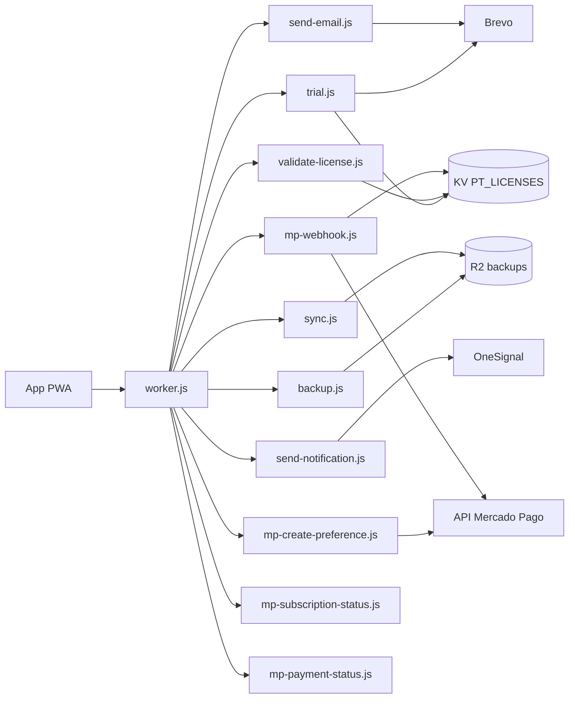

# SERVICES — Backend y servicios externos

El backend de ParfumTrack **no guarda datos del negocio del usuario**. Solo se ocupa de
licencias, pagos, emails, push y backups opacos.

**Router:** `worker.js` · **Handlers:** `functions/*.js` · **Runtime:** Cloudflare Workers

---

## 1. Mapa de servicios



---

## 2. `_shared.js` — la base de todo · 522 líneas

**Todos los handlers dependen de este archivo.** Si tocás algo acá, lo tocás en los 10
endpoints a la vez.

| Área | Funciones |
|---|---|
| CORS | `ORIGIN_RE`, `corsHeaders()`, `validateOrigin()` |
| Respuestas | `json()`, `requestId()` |
| Rate limiting | `checkRateLimit()`, `checkBurstRateLimit()`, `checkIPRateLimit()`, `getAdaptiveThrottle()`, `recordBlockedRequest()` |
| CSRF | `validateDoubleSubmitCSRF()`, `validateCsrfToken()` |
| Auth | `verifyToken()`, `verifyTokenWithExpiry()`, `timingSafeEqual()` |
| Cripto | `sha256()`, `encryptSecret()`, `decryptSecret()`, `createAuthenticatedEncryption()`, `verifyAuthenticatedEncryption()` |
| Entrada | `requireJson()`, `parseJsonBody(request, maxBytes = 1 MB)`, `isValidEmail()` |
| Logging | `log()`, `sanitizeData()`, `hashIp()` |
| Utilidad | `delay()` |

**Detalles que importan:**

- `ORIGIN_RE` es la whitelist única:
  `localhost` / `127.0.0.1` (cualquier puerto) + `parfumtrack.luccasramireziglesias.workers.dev`
  + `parfumtrack.pages.dev`. Un origen no permitido recibe `Access-Control-Allow-Origin: null`.
- `timingSafeEqual()` evita ataques de temporización al comparar tokens.
- `sanitizeData()` limpia los logs antes de escribirlos: **nunca loguear secrets ni PII**.
- `hashIp()` hashea la IP para el logging.
- `parseJsonBody()` limita el cuerpo a 1 MB por defecto (el router ya cortó en 5 MB).
- Los rate limits de este archivo son **fail-closed** (si KV falla, rechazan).

---

## 3. Endpoints

### `/trial` — POST · `trial.js` · 386 líneas

Registro por OTP de 6 dígitos.

```
POST /trial { step: "register", email, deviceId }
  → genera OTP, lo guarda en KV (TTL 10 min), lo manda por Brevo
  → { sent: true }

POST /trial { step: "verify", email, otp, deviceId }
  → valida el OTP y ancla el trial
```

**Quién lo usa:** `12-cuenta-licencia.js` (`registrarCuenta()`, `verificarOTP()`).
**Depende de:** KV, Brevo.
**Nota:** el ancla de trial va contra `deviceId` + email para dificultar resetearlo
borrando localStorage.

### `/validate-license` — POST · `validate-license.js` · 214 líneas

Valida un código `PT-XXXXXX-YYYYYY` con **ECDSA**.

**Secrets:** `LICENSE_SERVER_SECRET`, `LICENSE_PRIVATE_KEY`.
**Quién lo usa:** `12-cuenta-licencia.js` (`activarLicencia()`).
**🔴 Efecto en el cliente:** una licencia válida escribe `pt_license_code`, y eso
**activa el cifrado de los 8 stores de negocio**.

### `/backup` — GET · POST · `backup.js` · 153 líneas

```
POST /backup { code, token, data }        → guarda en R2
GET  /backup?code=XXX&token=YYY           → restaura
```

**Auth:** HMAC-SHA256 del `code` con `LICENSE_SERVER_SECRET`.
**Storage:** R2 `parfumtrack-backups`.
**Quién lo usa:** `10-data-management.js` (`backupToCloud()`, `restoreFromCloud()`).
**🔴 El restore REEMPLAZA todos los datos locales.**

### `/sync` — GET · POST · `sync.js` · 164 líneas

Mismo mecanismo que `/backup`, key R2 `sync/{code}`. Pensado para el plan Pro
(multi-dispositivo), hoy expuesto como sync manual desde la pantalla de cuenta.

### `/send-email` — POST · `send-email.js` · 347 líneas

Email transaccional vía **Brevo**. Plantillas en `_email-templates.js`.

**Config:** `FROM_EMAIL=parfumtrack@gmail.com`, `FROM_NAME="Parfum Track"`.
**Secret:** `BREVO_API_KEY`.
**🔴 Regla del proyecto:** `List-Unsubscribe` obligatorio en **todos** los emails.
**🔴 El email oficial es `parfumtrack@gmail.com`.** Nunca `hola@parfumtrack.com` — aparece
en un comentario viejo de `send-email.js` como ejemplo y **no es el valor real**.

### `/send-notification` — POST · `send-notification.js` · 117 líneas

Push vía **OneSignal**. Body: `{ subscriptionId, title, message, url }`.
**Secrets:** `ONESIGNAL_APP_ID`, `ONESIGNAL_API_KEY`.
> El comentario del archivo menciona `ONESIGNAL_REST_KEY` y "Cloudflare Pages" — quedó de
> cuando el proyecto estaba en Pages. El nombre real del secret es `ONESIGNAL_API_KEY`.

### Mercado Pago — 4 endpoints

| Endpoint | Método | Archivo | Qué hace |
|---|---|---|---|
| `/mp-create-preference` | POST | 116 líneas | `{ email, plan: "monthly"\|"annual" }` → `{ initPoint }` |
| `/mp-webhook` | POST · GET | **512 líneas** | Webhook de pagos. GET devuelve 200 para la verificación de MP |
| `/mp-subscription-status` | GET | 65 líneas | Estado de suscripción |
| `/mp-payment-status` | GET · POST | 117 líneas | Estado de un pago |

**Secrets:** `MP_ACCESS_TOKEN`, `MP_WEBHOOK_SECRET`.
**Config:** `MP_CURRENCY_ID=USD`, `MP_AMOUNT_MONTHLY=9.99`, `MP_AMOUNT_ANNUAL=95.88`.

**`mp-webhook.js` es el archivo más complejo del backend.** Verifica la firma
`X-Signature`, valida el `external_reference`, deduplica eventos (MP reintenta), genera la
licencia y manda el email. Tiene 5 suites de test dedicadas.

### `/health` — GET · en `worker.js`

Ping a KV. `200` si responde, `503` si no. `Cache-Control: no-store`.

### `/force-update` — GET · en `worker.js`

Devuelve una página con `Clear-Site-Data: "cache", "storage"`. Escotilla de emergencia
para usuarios con cache envenenado.
**🔴 Borra el storage del navegador — incluida IndexedDB.** No la mandes a un usuario sin
avisarle que haga backup primero.

### `/generate-owner-license` · `/debug-license` — administrativos

Generación de licencias propietarias y diagnóstico. La licencia del owner es
`PT-YINYD4-2ML61A7T`. También existe `scripts/generate-license.js` para hacerlo desde
la línea de comandos.

---

## 4. 🔴 `/version` — existe pero NO está ruteado

`functions/version.js` existe, `build.js` le sincroniza la versión desde `package.json`,
y `17-auto-update.js` hace `fetch('/version')` al arrancar y cada 5 minutos.

**Pero `worker.js` no lo importa ni lo lista en `GET_ROUTES`.** La request cae en
`env.ASSETS.fetch()`, que busca un archivo llamado `version` en la raíz y devuelve 404.
El `catch` de `_checkForUpdates()` se lo come con un `console.warn`.

**Consecuencia: la actualización automática nunca dispara.**

Además `version.js` exporta `export default { fetch }` (formato Worker), mientras que el
resto exporta `onRequestGet`/`onRequestPost`. Rutearlo requiere adaptar la firma.

*Verificado leyendo el código. **No confirmado contra producción** — este entorno no tiene
red saliente.* Ver [TODO.md](TODO.md) §T-01.

---

## 5. Servicios externos

| Servicio | Para qué | Secret | Falla si… |
|---|---|---|---|
| **Mercado Pago** | Suscripciones y webhooks | `MP_ACCESS_TOKEN`, `MP_WEBHOOK_SECRET` | Nadie puede pagar |
| **Brevo** | OTP y notificaciones por email | `BREVO_API_KEY` | Nadie puede registrarse |
| **OneSignal** | Push | `ONESIGNAL_APP_ID`, `ONESIGNAL_API_KEY` | Se pierden los push (degradación suave) |
| **Plausible** | Analytics sin cookies, GDPR | — | Se pierden métricas (sin impacto funcional) |

**Puntos únicos de falla:** Brevo (bloquea el registro) y Mercado Pago (bloquea el cobro).
No hay proveedor de respaldo para ninguno de los dos.

---

## 6. Almacenamiento del servidor

### KV `PT_LICENSES`
| Prefijo | Contenido | TTL |
|---|---|---|
| `rl_global_{ip}_{minuto}` | Rate limit global | 120 s |
| `conn_{ip}_{path}` | Concurrencia por IP | 5 s |
| OTPs | Códigos de registro | 600 s |
| Licencias | Códigos válidos y su estado | — |
| Anclas de trial | Inicio del trial por device/email | — |
| Dedup de webhooks | Eventos MP ya procesados | — |

### R2 `parfumtrack-backups`
- `{code}` → backup del usuario
- `sync/{code}` → estado de sync

**El contenido está cifrado del lado del cliente. El servidor no puede leerlo.**

---

## 7. Configuración

**Secrets** (Cloudflare Dashboard, nunca en el repo):
`BREVO_API_KEY` · `LICENSE_SERVER_SECRET` · `LICENSE_PRIVATE_KEY` · `MP_ACCESS_TOKEN`
· `MP_WEBHOOK_SECRET` · `ONESIGNAL_APP_ID` · `ONESIGNAL_API_KEY`

**Vars** (`wrangler.jsonc`, públicas):
`FROM_EMAIL` · `FROM_NAME` · `APP_URL` · `MP_CURRENCY_ID` · `MP_AMOUNT_MONTHLY`
· `MP_AMOUNT_ANNUAL` · `OWNER_EMAIL`

**Bindings:** `ASSETS` (estáticos) · `PT_LICENSES` (KV) · `PT_BACKUP` (R2)

---

## 8. Agregar un endpoint — checklist

1. Crear `functions/mi-endpoint.js` exportando `onRequestPost` y/o `onRequestGet`.
2. Importarlo en `worker.js`.
3. Sumar la ruta a `POST_ROUTES` y/o `GET_ROUTES`.
4. Agregar el `if (path === '/mi-endpoint')` en el bloque del método.
5. Si es sensible, sumarla a `CRITICAL_ROUTES` (límite de concurrencia).
6. 🔴 Usar `checkRateLimit()` de `_shared.js` — **fail-closed**, es regla del proyecto.
7. 🔴 Usar `corsHeaders()`, nunca `Access-Control-Allow-Origin: *`.
8. 🔴 Validar la entrada con `parseJsonBody()` + `requireJson()`.
9. 🔴 Loguear con `log()`, que pasa por `sanitizeData()`.
10. Escribir el test en `tests/`.

**El paso 3 es el que más se olvida.** Sin él, el endpoint responde 404 aunque el archivo
exista y esté importado — que es exactamente lo que le pasa a `/version`.
