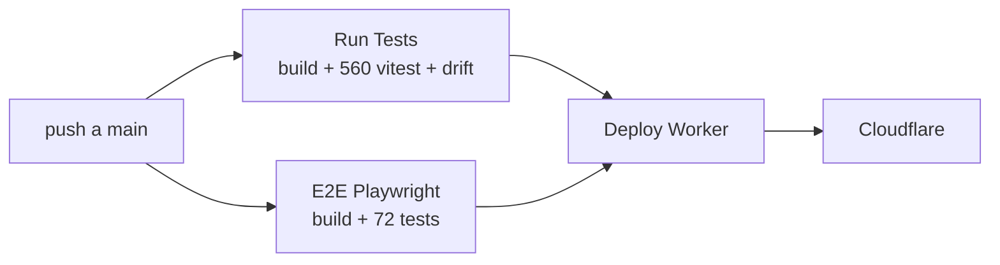

# TESTING — Estrategia de tests

**Estado actual: 621 Vitest + 116 Playwright. Los dos corren en CI y frenan el deploy.**

---

## 1. Filosofía

Esta app maneja **plata**. La clase de bug más cara no es la que rompe la pantalla: es la
que muestra un número equivocado **sin lanzar ningún error**. Un cliente debe $2000 y la
app dice $0.

Toda la estrategia de tests apunta a esa clase de bug:

| Capa | Qué protege |
|---|---|
| **Regresiones estáticas** (Vitest) | Que nadie revierta una decisión de diseño |
| **E2E** (Playwright) | Que los flujos reales funcionen en un navegador real |
| **Fuzzer** | Invariantes de plata bajo secuencias que nadie escribiría a mano |
| **Sondas de riesgo** | Las zonas que ningún test cubría |
| **Volumen** | Que la app siga usable dentro de tres años |

---

## 1 bis. 🔴 Las dos formas en que esta suite ya mintió

Dos incidentes de producción el mismo día, los dos con la suite entera en verde. Vale más
entender el patrón que los bugs:

| Qué falló | Por qué el test no lo vio |
|---|---|
| **BUG-24** — KV rechaza `expirationTtl < 60`; el router usaba 5 y tumbó 5 rutas críticas | El mock de KV **aceptaba cualquier TTL** |
| **BUG-25** — el cliente no mandaba el `challenge` que el backend exige | 24 tests del backend, todos con un cliente ideal **que no existía** |

**Las reglas que salieron de ahí:**

1. 🔴 **Un mock que no rechaza lo que el servicio real rechaza no prueba nada.** Si la
   plataforma tiene un límite (TTL mínimo, tamaño máximo, formato), el mock lo tiene que
   hacer cumplir.
2. 🔴 **Probar los dos lados por separado no prueba que hablen entre sí.** Cuando el backend
   exige un campo, tiene que haber un test de que el cliente lo manda.
3. 🔴 **Verificá que el test atrape el bug**: revertí el fix y mirá que falle. Los dos casos
   se comprobaron así.

---

## 2. Comandos

```bash
npm test                              # 621 Vitest
npx playwright test                   # 116 E2E (necesita la app en :8787)
npx playwright test tests/f3.spec.js  # un solo archivo
npx vitest run tests/features.test.js # una sola suite

FUZZ_CORRIDAS=30 FUZZ_OPS=120 npx playwright test tests/fuzz.spec.js
VOL_VENTAS=5000 npx playwright test tests/volumen.spec.js
```

⚠️ **Corré `node scripts/build.js` antes de los E2E.** Testean `index.html`, no `src/`.

---

## 3. Vitest — 621 tests, 35 archivos

Corren en Node, sin navegador. Dos tipos:

### a) Tests de comportamiento
Backend, plantillas de email, validaciones. Prueban funciones reales.

`trial.test.js` · `validate-license.test.js` · `backup.test.js` · `sync.test.js` ·
`send-email.test.js` · `send-notification.test.js` · `shared.test.js` · `worker.test.js` ·
`mp-*.test.js` (6 archivos) · `ph3-*.test.js` (5) · `ph4-*.test.js` (3) ·
`email-templates.test.js` · `db-encryption.test.js` · `critical-data-safety.test.js`

### b) 🔵 Regresiones estáticas — el patrón distintivo del proyecto

`features.test.js` y `hardening.test.js` **leen el código fuente como texto** y verifican
que ciertas decisiones sigan ahí.

```js
const render = read('src/app/02-render.js');

it('las cuotas se ordenan por vencimiento más próximo', () => {
  const idx = render.indexOf('renderCuotas(reset = true)');
  const cuerpo = render.slice(idx, idx + 3000);
  expect(cuerpo).toMatch(/proxima\.vence \|\| 0\) - \(b\.proxima\.vence \|\| 0/);
});
```

**Por qué existen.** Un test funcional verifica que hoy funcione. Estos verifican que
**nadie revierta la decisión** — la optimización, la guarda, el patrón. Son la memoria
institucional del proyecto en forma ejecutable.

**Ejemplos de lo que protegen:**
- Que las agregaciones usen `_ventasActivas()` (falla si aparece `this.ventas.filter(`)
- Que las 5 listas de stores incluyan los stores nuevos
- Que el `sort` de cuotas no tenga trabajo adentro
- Que `_renderVentaCard` reciba `index` en vez de usar `indexOf`
- Que exista el paginado de ventas y de cuotas
- Que `_once('pago-cuota')` siga envolviendo el pago
- Que la versión salga solo de `package.json`
- Que el SRI sha384 siga en jsPDF y XLSX

**⚠️ Su fragilidad.** Se rompen al renombrar una variable aunque el comportamiento no
cambie — pasó al renombrar `gruposOrdenados` a `conProxima`. **Cuando falle una, preguntate
si el comportamiento sigue estando**: si sí, actualizá el test para que verifique el
comportamiento y no el nombre.

---

## 4. Playwright — 116 tests

Corren contra la app real en `http://localhost:8787`.

| Archivo | Qué cubre |
|---|---|
| `app.spec.js` | Flujos generales |
| `f1.spec.js` | Cantidad en la venta |
| `f2.spec.js` | Recordatorios de cobro |
| `f3.spec.js` | Devoluciones y cambios (8 tests) |
| `f4.spec.js` | Compras al proveedor |
| `f5.spec.js` | Señas y encargos |
| `alertas.spec.js` | Alertas de stock colapsables |
| `importar.spec.js` | Importador de Excel (lógica) |
| `splash.spec.js` | Pantalla de carga |
| `fuzz.spec.js` | 🔵 Fuzzer de invariantes |
| `riesgos.spec.js` | 🔵 Sondas de riesgo de datos |
| `volumen.spec.js` | 🔵 Comportamiento con historial de 3 años |
| `concurrencia.spec.js` | 🔵 Dos pestañas escribiendo + interrupción a mitad de operación |
| `pulido.spec.js` | Formato de montos, perfume duplicado, planilla reimportada |
| `header.spec.js` | El nombre del negocio no tapa el chip de cuenta |
| `negocio.spec.js` | Perfil del negocio: guardado, logo, y dónde salen los datos |

### 🔴 Preámbulo obligatorio de todo E2E

```js
await page.route('**/*.googleapis.com/**', r => r.abort());
await page.route('**/plausible.io/**', r => r.abort());
await page.addInitScript(() => {
  localStorage.setItem('pt_onboarded', '1');
  localStorage.setItem('pt_consent_accepted', '1');   // ← si falta, la suite se cuelga
});
await page.goto(APP_URL, { waitUntil: 'domcontentloaded' });
await page.waitForFunction(() => localStorage.getItem('pt_demo_seeded') === '1');
await page.waitForTimeout(1200);
```

Sin las banderas, el modal de consentimiento bloquea la UI y **todos** los tests fallan por
timeout. Fue la causa de que la suite estuviera rota (4/8) sin que nadie se enterara.

### 🔴 Las cuatro trampas de escribir E2E acá

| Trampa | Por qué | Solución |
|---|---|---|
| Esperar `App.ventas !== undefined` | Es `[]` desde el objeto literal: resuelve al instante | Esperar `pt_demo_seeded === '1'` |
| Leer el DOM justo después de mutar | `renderAll()` está debounceado 100 ms | Llamar `App.renderDashboard()` directo |
| Medir el arranque esperando `App.ventas` | `loadData()` llena las cuotas después | Esperar `#splash` `state: 'detached'` |
| Sembrar con `DB.add` y renderizar | La base tiene los datos, la memoria no | `await App.loadData()` |
| Un `appConfirm` dentro de otro modal no se puede clickear | Los dos overlays comparten z-index | Ya arreglado (BUG-22); si vuelve a pasar, revisá `17-modal.css` |

También: **scopeá los locators.** `.tag-devuelta` matchea en `#ventas-recientes` **y** en
`#ventas-all-list` → violación de strict mode.

---

## 5. 🔵 El fuzzer — `tests/fuzz.spec.js`

En vez de casos escritos a mano, tira **secuencias aleatorias largas** de operaciones
(vender, editar, borrar, devolver, revertir, comprar, cobrar cuotas, reservar, entregar) y
después de **cada una** verifica invariantes que nunca pueden romperse.

**Semilla fija:** una falla se tiene que poder reproducir. Al fallar imprime la secuencia
exacta que llevó al problema.

**Invariantes que verifica:**
```
stock ≥ 0 y numérico
precioVenta numérico
unidadesDescontadas ≤ cantidad
las cuotas de una venta suman su precioVenta (±1,5)
  · excepción: venta devuelta ⇒ suma menor, y lo que queda tiene plata puesta
ninguna cuota pagada de más ni con pago negativo
no hay cuotas huérfanas
ninguna venta devuelta cuenta como activa
compra: total = precioUnitario × cantidad
reserva: seña ≤ total
reserva entregada ⇒ tiene ventaId
```

**Distingue rechazo legítimo de bug:** que la app rechace un sobrepago está bien; un
`TypeError` no. El regex de errores esperados vive en `fuzz.spec.js:209`.

**Lo que encontró.** BUG-17: deshacer una devolución no recreaba las cuotas canceladas —
la venta volvía a contar para la ganancia pero **la deuda del cliente desaparecía**.
Ninguna revisión humana lo había visto. Ese hallazgo justificó dejarlo en CI.

---

## 6. 🔵 Sondas de riesgo — `tests/riesgos.spec.js`

Cinco pruebas sobre zonas que nada cubría:

1. **Backup de ida y vuelta, campo por campo** — exportar, borrar, restaurar, comparar.
2. **Nombres con HTML y emojis** — `<script>window.__hackeado`, `onerror=`. Verifica que
   no se ejecute nada.
3. **Montos del borde** — que no aparezca `NaN`, `undefined` ni `Infinity` en los totales.
4. **La app con encriptación activa** — y que esté cifrado **de verdad en disco**:
   `crudo[0]._encrypted` existe y el nombre del cliente **no** se lee en claro. También
   verifica que no se dupliquen registros al cifrar (BUG-07).
5. **Migración de una base v3 real** — abre `ParfumTrackDB` v3 desde una URL que no levanta
   la app (si no, `deleteDatabase` queda bloqueado por la conexión abierta) y verifica que
   llegue a ≥5 con los datos intactos.

---

## 7. 🔵 Volumen — `tests/volumen.spec.js`

Siembra 2000 ventas, 1500 cuotas y 120 perfumes repartidos en tres años, y mide arranque y
cada pantalla. Tres tests: rendimiento general, arranque cifrado, y paginado de cuotas.

Umbrales y resultados en [PERFORMANCE.md](PERFORMANCE.md).

**Helper `sembrar(page, ventas, perfumes)`:** inserta directo con `DB.add`, **sin pasar por
`addVenta`** — acá interesa medir lectura y render, no el alta.
⚠️ Escribe en la base pero **no llama `App.loadData()`**: si tu test lee de memoria,
llamalo vos.

---

## 7 bis. 🔵 Concurrencia — `tests/concurrencia.spec.js`

Dos pestañas (`context.newPage()` dos veces: comparten IndexedDB) escribiendo en paralelo,
y la app cortada a la mitad de una operación con `page.reload()`.

**No asumen que la app tiene locking sobre todo.** Verifican que el estado que queda sea
**coherente** aunque se pierda la escritura de una de las pestañas:

```
el stock que bajó == lo que las ventas descontaron − lo que las devoluciones repusieron
ninguna cuota apunta a una venta que no existe
una venta en cuotas tiene TODAS sus cuotas o ninguna  (las devueltas quedan afuera)
ningún id de venta duplicado
```

**Lo que encontró.** BUG-21: 20 ventas descontando 20 unidades y el stock bajando 13.
Ver [BUG_HISTORY.md](BUG_HISTORY.md).

---

## 8. CI — `.github/workflows/deploy.yml`



`deploy` depende de **`[test, e2e]`**: si cualquiera falla, no hay deploy.

**Paso "Verify build is committed (no drift)":**
```bash
git diff --exit-code index.html
```
Falla si tocaste `src/` y no commiteaste el `index.html` regenerado. Es la salvaguarda
contra el error más común del proyecto.

---

## 9. Casos pendientes

| # | Qué falta | Prioridad |
|---|---|---|
| C-03 | Clicks de la UI del importador (la lógica sí está) | 🟡 |
| C-04 | Flujo completo de Mercado Pago punta a punta | 🟡 |
| C-05 | `QuotaExceededError` con el storage lleno | 🟡 |
| C-06 | Fotos muy grandes en el backup | 🟢 |

---

## 10. Cómo escribir un test nuevo

### ¿Vitest o Playwright?

| Usá Vitest si… | Usá Playwright si… |
|---|---|
| Es lógica de backend | Toca IndexedDB |
| Es una función pura | Involucra el DOM |
| Querés congelar una decisión de diseño | Es un flujo de usuario |
| Querés que sea rápido | Necesitás el navegador real |

### Plantilla de regresión estática

```js
describe('Mi feature', () => {
  const mod = read('src/app/NN-mi-modulo.js');

  it('explica QUÉ decisión protege, no qué string busca', () => {
    // Un comentario con el POR QUÉ: qué se rompía antes
    expect(mod).toContain('_MI_CONSTANTE');
  });
});
```

### Plantilla E2E

```js
test('describe el comportamiento del usuario', async ({ page }) => {
  // …preámbulo obligatorio (§4)…
  await page.evaluate(async () => {
    // limpiar y sembrar un estado controlado
    for (const v of await DB.getAll('ventas')) await DB.delete('ventas', v.id);
    await App.loadData();
  });
  // actuar
  await page.evaluate(() => App.renderDashboard());   // directo, no renderAll
  // verificar
  await expect(page.locator('#hero-ganancia')).toContainText('800');
});
```

---

## 11. Reglas

1. 🔴 **Todo bug arreglado lleva un test** que falla sin el fix.
2. 🔴 **Toda decisión de diseño no obvia lleva una regresión estática.**
3. 🔴 **Los E2E setean `pt_onboarded` y `pt_consent_accepted`.**
4. 🔴 **Corré `build.js` antes de los E2E.**
5. 🟠 **Los tests explican el POR QUÉ en un comentario**, igual que el código.
6. 🟠 **Un test que falla por un renombre se actualiza**, no se borra: verificá primero que
   el comportamiento siga estando.
7. 🟠 **Nunca un test que dependa del reloj real** sin controlarlo — el fuzzer usa semilla fija.
